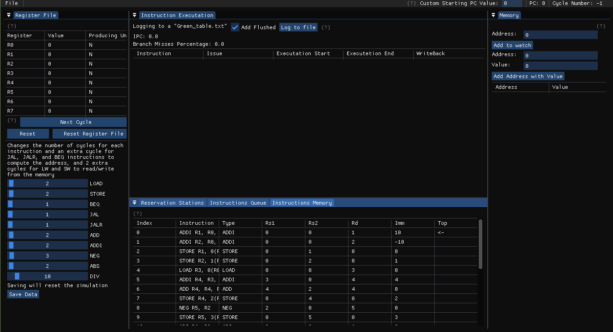
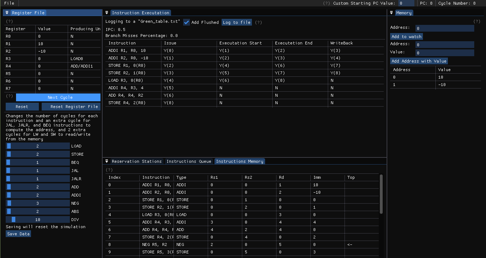
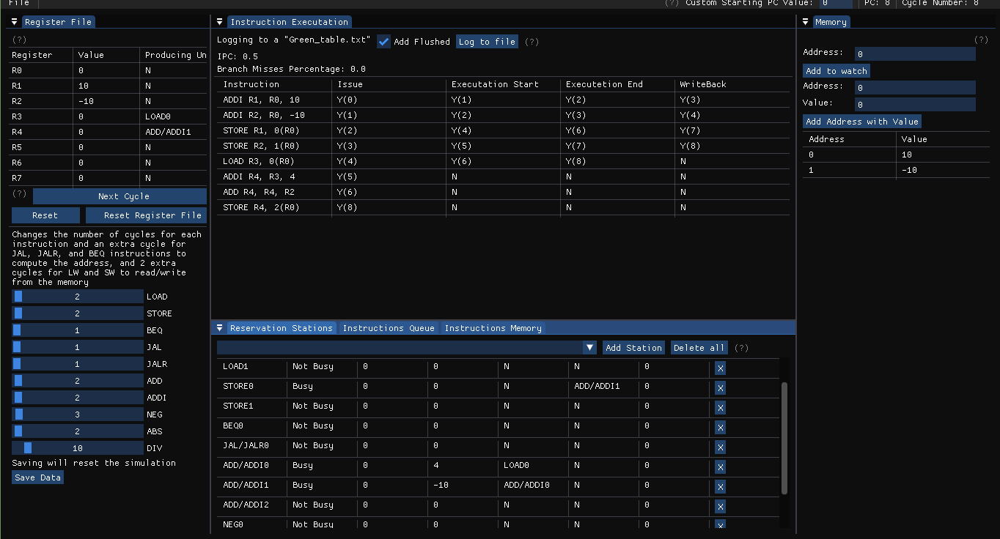

# TomasolosAlgorithm

This is an implementation of Tomasolos Algorithm with SFML, imgui, and C++. The ISA used in for this project is 16-bit RISC ISA that consists of 10 instructions.

Tomasolos Algorithm is an algorithm designed for out of order instruction scheduling and execution.

This project is created as a university project under the supervision of **Professor Cherif Salama**.

### **NOTE**:

The master branch contains the Linux version of the project with a Makefile and all the needed dependances given.

## Showcase

This is the normal view of the program and this is the first look into it.

This is a preview of the instructions while being executed.

This is a preview of the reservataion stations.

---

## Dependencies

- The library used to create the window and render the GUI onto the screen is the [**SFML**](https://www.sfml-dev.org/index.php) library.
- The GUI library named: [**ImGui**](https://github.com/ocornut/imgui).
- The SFML extension to ImGui: [**ImGui-SFML**](https://github.com/eliasdaler/imgui-sfml).
- ImGui File Dialog extension to be able to load files easily: [**ImGuiFileDialog**](https://github.com/aiekick/ImGuiFileDialog/).

---

## Compling the Project

If you are running Windows OS, check out the branch _Windows_. It has an implmentation of the project on _Visual Studio_.

**This compilation process was tested and used on Linux Mint 20.**

Make sure you install all the dependences used by SFML. Find this guide from the SFML website [here](https://www.sfml-dev.org/tutorials/2.5/start-linux.php).

_Or_ you can run this command in your terminal:

    sudo apt-get install libsfml-dev

After you have aquired all the needed dependencies, you should be able to compile the project from ground up.

You can follow these command line commnds:

    git clone --recursive <repo Link>
    cd TomasolosAlgorithm
    make
    ./Proj.out

NOTE: The output file is named: _Proj.out_.
Then wait until it ends compiling the project and the required dependances.

---

## Project Assumptions

Based on the project description, the following assumptions were taken into consideration.

- The program executes on a single-issue processor and has only three backend stages: _Issue, Execute, and WriteBack_
- We have only 8 general purpose registers named R0-R7, and R0 always has the value 0.
- We have a 128KB memory that is also word addressable.
- The word in this ISA is 16 bit.
- Branch instructions have an always not taken predictor.
- All the instruction given to the program were fetched decoded and now are ready to enter the instruction Queue.
- No input/output instructions are used.
- No interrupts or exceptions to be handled.
- Each reservation station has a functionl unit dedicated to it.
- No cache or virtual memory.

---

## What the simulator can do

This is a list of the different things the simulator can do to be user-friendly and be as simple as possible to be used for educational purposes.

- You can load instructions from a text file by clicking on **_File_** then _Load Instructions_ in the menu bar. (it has to have the extension **.txt**).
- You can add comments to the instructions file by writing # in it. For differnet examples on how to do it see the default program in _DefaultProgram.txt_.
- You can change the number or reservation stations and add and remove whatever number of stations you want.
- You can change the number of cycles needed for each instruction.
- You can add specific addresses to watch in the memory as well as give it initial values by adding specific values to addresses.
- You can reset the cycles and the simulation and start it all over again one by one.
- The simulator has the capacity of holding up to 3000 instructions in the queue.
- You can make the program fullscreen by clicking the button **F**, and exit the program by clicking **Escape** or finding the option _Close Application_ in the **File** menu
- You can resize the windows and rearrange them the way you want.
  - If it happens and the windows start without them being docked to a certain spot on the screen, you can dock them yourself by dragging the window title and placing it where you want.
- You can find around the program Question marks **_(?)_**. If you hover on them, you will have an info box that has some information about that window.
